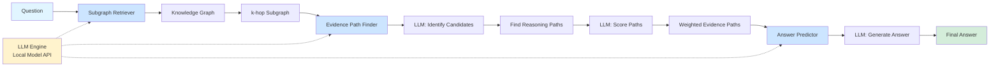

# EPERM System Architecture



## Component Details

### 1. Subgraph Retriever
**Input:** Question string  
**Output:** Relevant KG subgraph  
**Process:**
- Extract entity mentions using LLM
- Match entities to KG
- Retrieve k-hop neighborhood
- Limit subgraph size

### 2. Evidence Path Finder
**Input:** Question + Subgraph  
**Output:** Scored reasoning paths  
**Process:**
- LLM identifies answer candidates
- Find paths connecting entities
- Score each path with LLM
- Rank by relevance/confidence

### 3. Answer Predictor
**Input:** Question + Evidence Paths  
**Output:** Final answer + confidence  
**Process:**
- Select top-k evidence paths
- Generate answer using LLM
- Compute confidence score
- Return with supporting evidence

## Data Flow

```
Question: "Who founded Microsoft?"
    ↓
Entity Extraction (LLM)
    → ["Microsoft"]
    ↓
Subgraph Retrieval (KG)
    → Entities: {Microsoft, Bill Gates, Paul Allen, Windows, Seattle}
    → Relations: {founded, co-founded, developed, headquartered_in}
    ↓
Answer Candidates (LLM)
    → ["Bill Gates" (0.95), "Paul Allen" (0.85)]
    ↓
Path Discovery (Graph Algorithm)
    → Path 1: Bill Gates --[founded]--> Microsoft
    → Path 2: Paul Allen --[co-founded]--> Microsoft
    ↓
Path Scoring (LLM)
    → Path 1: score=0.95, "Direct founder relationship"
    → Path 2: score=0.85, "Co-founder relationship"
    ↓
Answer Generation (LLM)
    → Answer: "Bill Gates"
    → Confidence: 0.95
    → Reasoning: "Bill Gates is identified as the founder of Microsoft"
```

## Files Overview

```
KG-LLM-20251110/
├── config.py                   # System configuration
├── llm_client.py              # LLM API wrapper
├── knowledge_graph.py         # KG data structure
├── subgraph_retriever.py      # Module 1
├── evidence_path_finder.py    # Module 2
├── answer_predictor.py        # Module 3
├── eperm_system.py            # Main orchestrator
├── test_eperm.py              # Test suite
├── example_usage.py           # Interactive demo
├── requirements.txt           # Dependencies
├── README.md                  # Documentation
├── QUICKSTART.txt             # Quick start guide
└── data/
    └── sample_kg.json         # Example knowledge graph
```

## LLM Integration Points

The system uses your local LLM at **3 key points**:

1. **Entity Extraction** (Subgraph Retriever)
   - Prompt: Extract entities from question
   - Example: "Microsoft" from "Who founded Microsoft?"

2. **Path Scoring** (Evidence Path Finder)
   - Prompt: Score relevance of reasoning path
   - Example: Rate path "Bill Gates → founded → Microsoft"

3. **Answer Generation** (Answer Predictor)
   - Prompt: Generate answer from evidence
   - Example: Synthesize "Bill Gates" from multiple paths

## Running the System

```bash
# Install dependencies
pip install -r requirements.txt

# Run tests
python test_eperm.py

# Interactive mode
python example_usage.py

# Custom script
from eperm_system import EPERMSystem

system = EPERMSystem()
system.load_knowledge_graph("data/sample_kg.json")
answer = system.answer_question("Who founded Microsoft?")
print(f"Answer: {answer.answer} (confidence: {answer.confidence})")
```
