# Mermaid Diagrams - LAM Maze Platform (Action-Focused)

## Diagram 1: Large Action Model - Player Request to Game Action

```mermaid
sequenceDiagram
  autonumber
  actor U as 🧑 User / System
  participant Obs as 👁️ Observation
  participant L as 🧠 LLM Core
  participant Act as ⚙️ Action Layer
  participant Exec as 🛠️ Execution
  participant Tools as 🧩 Tools/APIs
  participant Log as 📑 Logs

  U->>L: Goal + constraints
  Obs-->>L: State updates (env/UI/sim)
  L->>Act: Intent → function choice
  Act->>Exec: Function + params (JSON)
  Exec->>Tools: Invoke API / command
  Tools-->>Exec: Result / error
  Exec-->>L: Structured result
  L-->>U: Summary / next step
  Note over L,Act: Monitor → Decide → Act loop
  Exec-->>Log: Trace & telemetry

```



---

## Diagram 2: All 10 Maze Actions Available to LAM


---

## Diagram 3: LAM Decision Logic - How LLM Chooses Actions


---

## Diagram 4: Complete Action Execution Flow

```mermaid
timeline
    title Action Execution Pipeline
    section User Request
        👤 Player sends help request
        🎨 Frontend captures via WebSocket
    section LLM Processing
        📝 Encode game state & context
        🧠 LLM thinks about situation
        🔍 Parse function calls
    section Action Pipeline
        🎯 Select best action
        ✅ Validate parameters
        ⚡ Execute in game engine
    section Update Cycle
        🔄 Update game state
        📤 Publish via MQTT
        🖼️ Render results to player
```



---

## Diagram 5: 10 Available Actions for LAM - By Category


---

## Diagram 6: Game Session - From Setup to Action Execution


---

## Diagram 7: LAM Action Request to LLM Response

```mermaid
flowchart TD
    A["📝 Request: Game State + Tools"] 
    B["🧠 LLM Backend Processing"]
    C["🤔 Reason About Actions"]
    D{"Choose<br/>Action Set"}
    E1["⚡ break_wall"]
    E2["❄️ freeze_germs"]
    E3["🔍 reveal_map"]
    F["📤 Response: Tool Calls + Params"]
    G["🔍 Parse Function Calls"]
    H["📥 Execute 10 Possible Actions"]
    I["✅ Return to Game"]
    
    A --> B --> C --> D
    D -->|Obstacle| E1
    D -->|Threat| E2
    D -->|Path| E3
    E1 --> F
    E2 --> F
    E3 --> F
    F --> G --> H --> I
```



---

## Diagram 8: Action Validation & Error Recovery


---

## Diagram 9: Action Execution - From Request to Game Update


---

## Diagram 10: Components for LAM Action Execution

```mermaid
erDiagram
    PLAYER ||--o{ SESSION : starts
    SESSION ||--|| TEMPLATE : uses
    SESSION ||--|{ ACTION : contains
    ACTION ||--|| GAMESTATE : updates
    GAMESTATE ||--|| LAMAGENT : reads
    LAMAGENT ||--o{ MQTT : publishes
    MQTT ||--o{ FRONTEND : forwards
    FRONTEND ||--|| DATABASE : stores
    
    PLAYER : int playerId
    PLAYER : string username
    
    SESSION : int sessionId
    SESSION : datetime startTime
    
    TEMPLATE : int templateId
    TEMPLATE : string systemPrompt
    
    ACTION : int actionId
    ACTION : string actionType
    ACTION : json parameters
    
    GAMESTATE : int stateId
    GAMESTATE : array playerPos
    GAMESTATE : array enemies
    
    LAMAGENT : int agentId
    LAMAGENT : string model
    
    MQTT : string topic
    MQTT : json payload
    
    FRONTEND : int frontendId
    FRONTEND : string wsUrl
    
    DATABASE : int dbId
    DATABASE : string dbPath
```

---

## Diagram 11: System Prompt → Selected Actions

```mermaid
quadrantChart
    title Action Selection Strategy Matrix
    x-axis Low Priority --> High Priority
    y-axis Low Urgency --> High Urgency
    reveal_map: 0.3, 0.2
    slow_germs: 0.5, 0.3
    break_wall: 0.7, 0.8
    freeze_germs: 0.8, 0.9
    speed_boost: 0.6, 0.7
    teleport: 0.5, 0.6
    move_exit: 0.4, 0.5
    highlight_path: 0.3, 0.4
    double_jump: 0.7, 0.4
    dig_tunnel: 0.6, 0.6
```

---

## Diagram 12: Action Performance & Reliability

```mermaid
bar
    title Action Processing Performance Metrics
    x-axis [LLM Think, Parse, Validate, Execute, Update, Total]
    y-axis "Time (ms)" 0 --> 1500
    bar [800, 10, 5, 20, 5, 1500]
```

---

## How to Use These Diagrams

### In Your Slides:
1. **Diagram 1**: Title slide - System overview
2. **Diagram 2**: Function calling pipeline - Core mechanism
3. **Diagram 3**: MQTT flow - Real-time architecture
4. **Diagram 4**: Complete data flow - End-to-end journey
5. **Diagram 5**: Available functions - What LLM can do
6. **Diagram 6**: Session management - User experience
7. **Diagram 7**: LLM client - Technical implementation
8. **Diagram 8**: Error handling - Reliability
9. **Diagram 9**: Sequence diagram - Step-by-step execution
10. **Diagram 10**: Deployment - Production setup
11. **Diagram 11**: Prompt→Action - Strategy pipeline
12. **Diagram 12**: Metrics - Performance validation

---

## Customization Tips

To modify these diagrams:

1. **Change colors**: Modify the `fill` and `stroke` values in classDef
2. **Add details**: Insert more nodes in the graph
3. **Simplify**: Remove subgraphs for simpler versions
4. **Reorder**: Reorganize node placement
5. **Add labels**: Insert more descriptive text on arrows

---

## Integration with Your Documentation

These diagrams can be embedded in:
- **Markdown files** (using ```mermaid code blocks)
- **Presentation software** (export as SVG/PNG)
- **Wiki pages** (direct Mermaid support)
- **Jupyter notebooks** (with mermaid extension)
- **Online tools** (mermaid.live)

---

**All diagrams are production-ready and can be directly copied into your presentation!** 🎉
