# Mermaid Diagrams - Quick Usage Guide

## What You Now Have

**12 production-ready Mermaid diagrams** showing every aspect of the LAM Maze platform architecture:

1. ✅ High-Level System Architecture
2. ✅ Function Calling Pipeline
3. ✅ MQTT Message Flow
4. ✅ Complete Data Flow
5. ✅ Game Action Functions
6. ✅ Session & Template Management
7. ✅ LLM Client Architecture
8. ✅ Error Handling & Fallback
9. ✅ Real-Time Messaging (Sequence)
10. ✅ Deployment Architecture
11. ✅ System Prompt → Action Pipeline
12. ✅ Performance Metrics Flow

---

## How to Use in Your Slides

### Option 1: Copy-Paste into Markdown/Presentation

```markdown
# Your Slide Title

Here's the LAM architecture:

​```mermaid
[Paste the mermaid code here]
​```
```

### Option 2: Render Online First

1. Visit: https://mermaid.live
2. Copy the mermaid code
3. Paste into the editor
4. See instant visualization
5. Export as SVG/PNG
6. Add to presentation

### Option 3: Use in PowerPoint/Keynote

1. Export SVG from mermaid.live
2. Insert into presentation software
3. Resize and position
4. Add caption/title

---

## Recommended Slide Order

### Slide 1: Overview (Diagram 1)
**Title**: "LAM Maze Platform - System Architecture"
**Content**: Diagram 1 (High-level overview)
**Purpose**: Set context, show all major components

### Slide 2: Core Concept (Diagram 2)
**Title**: "How Function Calling Works"
**Content**: Diagram 2 (Function calling pipeline)
**Purpose**: Explain the core LAM mechanism

### Slide 3: Real-Time Flow (Diagram 3)
**Title**: "Real-Time Communication via MQTT"
**Content**: Diagram 3 (MQTT flow)
**Purpose**: Show message routing

### Slide 4: Complete Journey (Diagram 4)
**Title**: "End-to-End Data Flow"
**Content**: Diagram 4 (Complete flow)
**Purpose**: Show complete request-response cycle

### Slide 5: Available Actions (Diagram 5)
**Title**: "10 Game Action Functions"
**Content**: Diagram 5 (Functions)
**Purpose**: Show what LLM can control

### Slide 6: Implementation (Diagram 7)
**Title**: "LLM Client Implementation"
**Content**: Diagram 7 (LLM client)
**Purpose**: Technical deep dive

### Slide 7: Reliability (Diagram 8)
**Title**: "Error Handling & Resilience"
**Content**: Diagram 8 (Error handling)
**Purpose**: Show robustness

### Slide 8: Execution Steps (Diagram 9)
**Title**: "Step-by-Step Execution"
**Content**: Diagram 9 (Sequence diagram)
**Purpose**: Show timing/ordering

### Slide 9: Production Ready (Diagram 10)
**Title**: "Production Deployment"
**Content**: Diagram 10 (Deployment)
**Purpose**: Show infrastructure

### Slide 10: Metrics (Diagram 12)
**Title**: "Performance & Scalability"
**Content**: Diagram 12 (Metrics)
**Purpose**: Show stats

---

## Quick Integration Examples

### In Markdown
```markdown
## System Architecture

The LAM Maze platform consists of:


### In HTML (for web presentations)
```html
<div class="mermaid">
graph TB
    ...
</div>

<script src="https://cdn.jsdelivr.net/npm/mermaid@10/dist/mermaid.min.js"></script>
<script>mermaid.contentLoaded();</script>
```

### In Jupyter Notebook
```python
from IPython.display import Markdown

mermaid_code = """
```mermaid
[your code here]
```
"""
display(Markdown(mermaid_code))
```

---

## Customizing Diagrams

### Change Colors

Find the classDef sections:
```mermaid
classDef frontend fill:#4A90E2,stroke:#2E5C8A,color:#fff
```

**Common colors**:
- Blue: #4A90E2 (information)
- Purple: #A23B72 (processing)
- Orange: #F18F01 (infrastructure)
- Green: #06A77D (success)
- Red: #FF6B6B (error)
- Yellow: #FFD700 (important)

### Simplify Diagrams

For beginner audience:
- Remove detailed subgraphs
- Use simpler flow
- Focus on main components only

### Expand Diagrams

For technical audience:
- Add error paths
- Include parameter details
- Show validation steps

---

## Visualization Tips

### Make Diagrams Clearer

1. **Add spacing**: Use multiple lines/levels
2. **Color code**: Use colors to group related items
3. **Label arrows**: Add text on connections
4. **Use icons**: Emoji for quick identification
5. **Organize**: Put similar items in subgraphs

### Size for Presentation

- Desktop: 1024x768 min
- Print: 300 DPI, 8.5x11"
- Mobile: Keep simple, minimize detail

---

## Common Modifications

### Add More Detail
```mermaid
Backend["Simple Backend"]
↓
Backend["Backend<br/>- FastAPI<br/>- Port 8000<br/>- 5 routers"]
```

### Simplify for Print
Remove emoji, use plain text:
```mermaid
User["User/Player"] → instead of → User["👤 Player"]
```

### Change Flow Direction
```mermaid
graph TB  ← Top-to-bottom (vertical)
graph LR  ← Left-to-right (horizontal)
graph BT  ← Bottom-to-top (inverted)
graph RL  ← Right-to-left (reverse)
```

---

## Export Options

### From Mermaid.live:
1. Click menu (⋮)
2. **SVG**: Best for presentations
3. **PNG**: Good for documents
4. **Markdown**: For wiki/docs
5. **Copy**: Copy code to clipboard

### From Command Line:
```bash
# Install mmdc
npm install -g @mermaid-js/mermaid-cli

# Convert to PNG
mmdc -i diagram.mmd -o diagram.png

# Convert to SVG
mmdc -i diagram.mmd -o diagram.svg -s 2
```

---

## Using in Different Tools

### PowerPoint
1. Save as PNG from mermaid.live
2. Insert → Picture → Select PNG
3. Resize to fit slide
4. Add caption

### Google Slides
1. Export as PNG
2. Upload to Google Drive or computer
3. Insert → Image → Select
4. Format as needed

### Keynote (Mac)
1. Export as PDF
2. Open in Preview
3. Copy and paste into Keynote

### Figma
1. Export as SVG
2. Open in browser
3. Screenshot or copy-paste
4. Edit in Figma

### Notion/Wiki
1. Save as Markdown
2. Copy code block
3. Paste with ```mermaid wrapper
4. Platform renders automatically

---

## Best Practices

✅ **DO**:
- Use clear, descriptive labels
- Choose consistent colors
- Keep diagrams focused
- Add legend if using many colors
- Test rendering on target platform

❌ **DON'T**:
- Overcrowd with information
- Use too many colors
- Make text too small
- Use unclear abbreviations
- Forget to test display

---

## Troubleshooting

### Diagram Doesn't Render

**Problem**: ```mermaid code block not working

**Solution**:
- Check fence is ```mermaid (with "mermaid")
- Verify no special characters in labels
- Test on mermaid.live first

### Text Too Small

**Problem**: Can't read labels in presentation

**Solution**:
- Increase font size: `fontSize: 16`
- Use shorter labels
- Export at higher resolution
- Display on larger screen

### Colors Look Wrong

**Problem**: Colors not displaying as expected

**Solution**:
- Check hex codes are valid (#XXXXXX)
- Test on different browser
- Try different export format
- Use web-safe colors

### Export Quality Poor

**Problem**: Blurry or pixelated export

**Solution**:
- Export as SVG instead of PNG
- Increase scale factor (-s 3 or -s 4)
- Try different export tool
- Render at larger size first

---

## Complete File Locations

**Mermaid diagrams**: `MERMAID_DIAGRAMS_LAM_MAZE.md`

**All 12 diagrams** are in one file, easily copy-pasteable:
- Diagram 1: Lines ~10-45
- Diagram 2: Lines ~47-85
- Diagram 3: Lines ~87-120
- ... and so on

---

## Quick Copy-Paste Template

```markdown
# [Your Slide Title]

## Overview

[1-2 sentences explaining diagram]

```mermaid
[Paste the mermaid code here]
```

## Key Takeaways

- Point 1
- Point 2
- Point 3
```

---

## Next Steps

1. ✅ Open `MERMAID_DIAGRAMS_LAM_MAZE.md`
2. ✅ Choose diagram you want to use
3. ✅ Copy the mermaid code block
4. ✅ Paste into mermaid.live or your document
5. ✅ Customize colors/text if needed
6. ✅ Export as PNG/SVG
7. ✅ Add to presentation

---

## Pro Tips

**Tip 1**: Create one "master" diagram slide, then zoom/crop for detail slides

**Tip 2**: Use consistent emoji across all diagrams (🎮 for game, 🧠 for LLM, etc.)

**Tip 3**: Export high-resolution versions for printing

**Tip 4**: Keep mermaid code in separate file for easy updates

**Tip 5**: Test all diagrams on actual presentation device before presenting

---

## Example: Using Diagram 1 in Slides

**Slide: LAM Maze Platform Overview**

```markdown
# Large Action Model - Maze Platform

The architecture consists of 4 layers:

```mermaid
graph TB
    subgraph Frontend["🎮 Frontend (React)"]
        Game["Maze Game"]
    end
    subgraph Backend["⚙️ Backend (FastAPI)"]
        API["API Routers"]
    end
    subgraph Infrastructure["🔌 Infrastructure"]
        LLM["LLM Server"]
    end
    subgraph Game["🎯 Game Environment"]
        State["Game State"]
    end
    
    Frontend --> Backend
    Backend --> Infrastructure
    Infrastructure --> Game
```



## Key Components:

1. **Frontend**: React-based web game UI
2. **Backend**: FastAPI with 5 routers
3. **Infrastructure**: LLM + MQTT + Database
4. **Environment**: Game physics and state

---

## Advanced Usage: Animated Diagrams

For interactive presentations, consider:
- Mermaid with JavaScript for interactivity
- SVG animations between diagrams
- Progressive disclosure (show one part at a time)
- Click-to-expand subgraphs

---

**Your diagrams are ready to use!** 🎉

Export, customize, and add to your presentation now.

